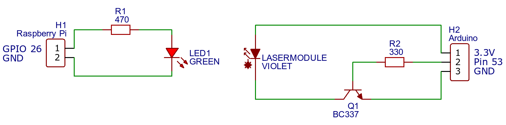

# Simple Demo Setup
These instructions will guide you through a simple example on how to send data through the covert 
channel:

1. Prepare the [hardware](#hardware) and point the laser directly to the LED. To check if laser and LED are aligned 
   correctly, you can turn on the laser and measure the induced current of the LED. If you see more than 30μA, the 
   transmission should work flawlessly.
2. Download the [Raspberry Pi image](https://tubcloud.tu-berlin.de/s/mM4ZfcfPnXjsDs3) and flash it.
3. Flash the [Arduino code](../attacker/laser/laser.ino).
4. SSH into the Pi (user: pi, password: raspberry) and run:
   ```bash
   sudo ./receive.sh
   ```
5. Determine which serial port is used by the Arduino and run:
    ```bash
    python3 send.py -b 40000 20000 10000 -d /dev/ttyACM0 -t
    ```
6. Type in a message and press enter.
7. Now you should see the transmitted message in your SSH session.
8. This example transmission was pretty slow (20 Bit/s). If you would like to try higher bitrates you can adjust the bit 
   durations on both sides.

### Hardware
You will need the following components:
- Transmitter:
    - Arduino Mega 2560
    - Laser module (e.g. 3V laserpointer violet)
    - BC337-16
    - 320 Ohm resistor
- Receiver:
    - Raspberry Pi 3B+
    - LED (green)
    - 470 Ohm resistor 
      
Connect the components according to this schematic::


### Other Targets
If you would like to try other targets you can use [pre-built images and tools](../pre_built).
All necessary information to run the tools is stated in the [usage instructions](usage.md).

Here are some example commands and settings:
- TL-WR1043ND (2000 Bit/s):
    ```bash
    sudo python3 send.py -b 400 200 100 -d /dev/ttyACM0 -t 
    ```
    ```bash
    insmod led_transceiver.ko
    ./receiver -d 250
    ```
    ```c
    // settings.h
    #define GPIO_PIN 5
    #define REC_MODE 1
    #define BIT_BUFFER_LENGTH 500
    #define MIN_DUR 5
    #define MAX_DUR 10000
    #define CAP_LOAD_TIME 10
    #define CAP_UNLOAD_TIME 1
    #define DISABLE_AR9331_WD
    ```

- T21P-E2 (133 Bit/s):
    ```bash
    sudo python3 send.py -b 6000 3000 1500 -d /dev/ttyACM0 -t 
    ```
    ```bash
    insmod led_transceiver.ko
    ./receiver -d 4500
    ```
    ```c
    // settings.h
    #define GPIO_PIN 112
    #define REC_MODE 1
    #define BIT_BUFFER_LENGTH 8000
    #define MIN_DUR 10
    #define MAX_DUR 1000000
    #define CAP_LOAD_TIME 1000
    #define CAP_UNLOAD_TIME 20
    ```
